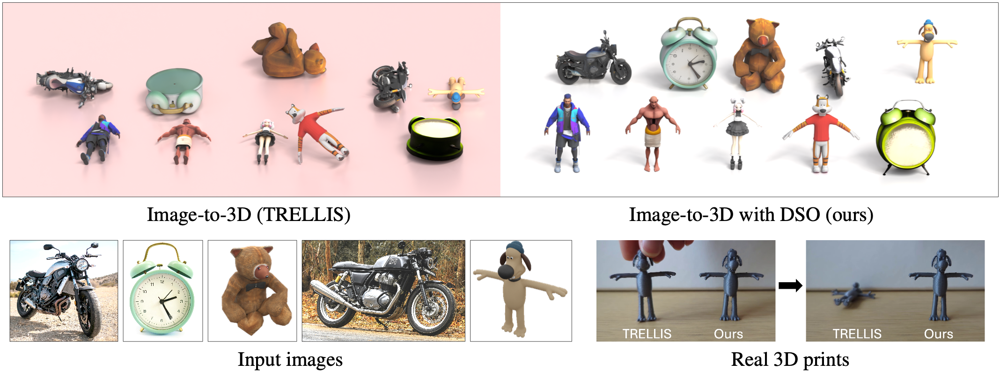

<h1 align="center">DSO: Aligning 3D Generators with Simulation Feedback for Physical Soundness</h1>
<p align="center">
<a href="https://arxiv.org/abs/2503.xxxxx"></a>
<a href="https://ruiningli.com/dso"></a>
<a href='https://huggingface.co/datasets/rayli/image-to-3D-eval-stability-under-gravity'></a>
</p>

<p align="center"></p>

<!-- Overview -->
## 🌟 Overview
- A state-of-the-art image-to-3D model like TRELLIS often **fails** to reconstruct 3D objects that can stand under gravity, even when prompted with images of stable objects.
- Our method, **DSO**, improves the image-to-3D model via **D**irect **S**imulation **O**ptimization, significantly increasing the likelihood that generated 3D objects can stand, both in physical simulation and in real life when 3D printed.
- The method **incurs no additional cost at test time** and thus generate such objects **in seconds**.

<!-- Installation -->
## 📦 Installation
1. Install the [TRELLIS](https://trellis3d.github.io/) dependencies:

```sh
conda create -n dso python=3.10
conda activate dso
pip install torch==2.4.0 torchvision==0.19.0 torchaudio==2.4.0 --index-url https://download.pytorch.org/whl/cu124
. ./setup.sh --basic --xformers --flash-attn --diffoctreerast --spconv --mipgaussian --kaolin --nvdiffrast
pip install kaolin==0.17.0 -f https://nvidia-kaolin.s3.us-east-2.amazonaws.com/torch-2.4.0_cu124.html
```

If you run into issues, please consult the [installation guide](https://github.com/Microsoft/TRELLIS?tab=readme-ov-file#-installation).

2. Install the remaining dependencies:

```sh
pip install -r requirements.txt
```

## 🤖 Pretrained Models

We provide two checkpoints, one trained with the [direct preference optimization](https://arxiv.org/abs/2311.12908) (DPO) and the other trained with our introduced **direct reward optimization** (DRO).

You can download them [here](https://huggingface.co/rayli/DSO-finetuned-TRELLIS):
```sh
git lfs install
git clone https://huggingface.co/rayli/DSO-finetuned-TRELLIS
```

#### Quick Start

You can generate **physically-sound** 3D assets conditioned on a single image using DSO-finetuned models with `example.py`:
```python
from peft import LoraConfig, get_peft_model
from PIL import Image
from safetensors.torch import load_file

from trellis.pipelines import TrellisImageTo3DPipeline
from trellis.utils import postprocessing_utils

ckpt_path = "./DSO-finetuned-TRELLIS/dro-4000iters.safetensors"  # "./DSO-finetuned-TRELLIS/dpo-8000iters.safetensors"
image_path = "./image-to-3D-eval-stability-under-gravity/clock-eval/01.jpg"  # Or your own image

pipeline = TrellisImageTo3DPipeline.from_pretrained("JeffreyXiang/TRELLIS-image-large")
pipeline.cuda()

peft_config = LoraConfig(
    r=64,
    lora_alpha=128,
    lora_dropout=0.0,
    target_modules=["to_q", "to_kv", "to_out", "to_qkv"]
)
pipeline.models["sparse_structure_flow_model"] = get_peft_model(pipeline.models["sparse_structure_flow_model"], peft_config)
pipeline.models["sparse_structure_flow_model"].load_state_dict(load_file(ckpt_path))

image = Image.open(image_path)
image = pipeline.preprocess_image(image)

outputs = pipeline.run(
    image,
    seed=0,
    preprocess_image=False,
    formats=["gaussian", "mesh"],
    sparse_structure_sampler_params={
        "steps": 12,
        "cfg_strength": 7.5,
    },
    slat_sampler_params={
        "steps": 12,
        "cfg_strength": 3,
    },
)[0]

glb = postprocessing_utils.to_glb(
    outputs['gaussian'][0],
    outputs['mesh'][0],
    simplify=0.95,          # Ratio of triangles to remove in the simplification process
    texture_size=1024,      # Size of the texture used for the GLB
    with_texture=True,      # Disable texture for faster stability evaluation
)
glb.export("./output.glb")
```

## 📊 Evaluation
1. Download the [evaluation dataset](https://huggingface.co/datasets/rayli/image-to-3D-eval-stability-under-gravity):

```sh
git lfs install
git clone https://huggingface.co/datasets/rayli/image-to-3D-eval-stability-under-gravity
```

2. Generate 3D models using trained checkpoint:

```sh
python finetune.py --eval --config configs/eval-objaverse.yaml
python finetune.py --eval --config configs/eval-real.yaml
```

3. Compute stability and geometry metrics:

```sh
python evaluation/evaluate_stability.py --mesh_paths "./samples/objaverse_samples/*.glb"
python evaluation/evaluate_stability.py --mesh_paths "./samples/motorcycle_samples/*.glb"
python evaluation/evaluate_geometry.py --mesh_paths "./samples/objaverse_samples/*.glb" --ground_truth_paths "/path/to/objaverse/hf-objaverse-v1/glbs"
```

## ⚙️ Training

```sh
# This runs on 4 NVIDIA A100s 80GB GPUs.

CUDA_VISIBLE_DEVICES=0,1,2,3 accelerate launch --multi_gpu --num_processes 4 --mixed_precision bf16 finetune.py --config configs/dpo.yaml 
```

## Citation

```bibtex
@article{li2025dso,
    title   = {DSO: Aligning 3D Generators with Simulation Feedback for Physical Soundness},
    author  = {Li, Ruining and Zheng, Chuanxia and Rupprecht, Christian and Vedaldi, Andrea},
    journal = {arXiv preprint arXiv:2503.xxxxx},
    year    = {2025}
}
```